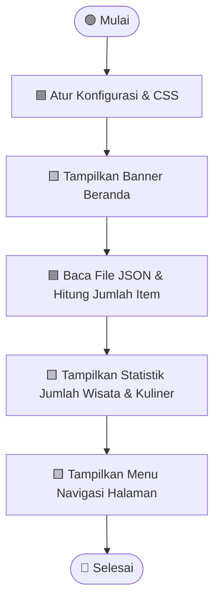
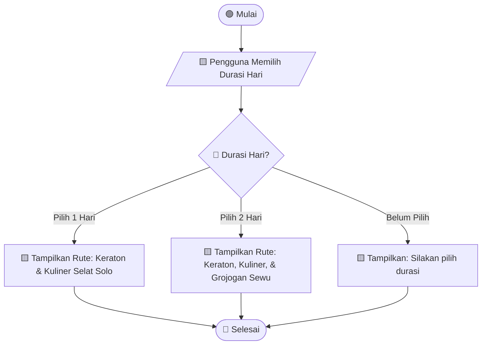
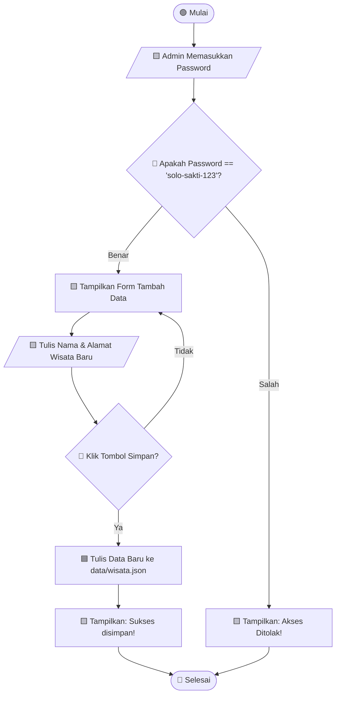

# 🏰 Panduan, Pseudocode, & Flowchart: Aplikasi Wisata "Monggo Pinarak"

Aplikasi **Monggo Pinarak** adalah portal wisata interaktif kota Solo yang dibuat menggunakan **Streamlit** dan **Python**. 

Di bawah ini adalah panduan terstruktur, *pseudocode* (bahasa manusia), dan **flowchart** (diagram alir) yang dirancang khusus agar mudah dipahami siswa SMP!

---

## 💡 Mengenal Simbol Flowchart (Diagram Alir)
Sebelum melihat diagram, yuk kenali bentuk-bentuknya:
* 🟢 **Oval (Mulai/Selesai)**: Awal dan akhir dari program.
* 🟦 **Persegi Panjang (Proses)**: Langkah komputasi atau tindakan (misal: memuat file, menghitung angka).
* 🔶 **Belah Ketupat (Keputusan / Percabangan)**: Pilihan kondisi (Ya atau Tidak).
* 🟨 **Jajar Genjang (Input/Output)**: Menerima masukan dari pengguna atau menampilkan hasil di layar.

---

## 📂 1. Peta Jalan: Struktur Folder Monggo Pinarak

Bayangkan repositori ini seperti sebuah **Restoran Tradisional Jawa**:
* **`app.py` (Pintu Utama / Beranda):** Halaman depan restoran tempat menyambut tamu, menampilkan menu utama, dan statistik singkat.
* **`pages/` (Ruangan-Ruangan Khusus):** Setiap ruangan punya tema sendiri:
  * `1_Informasi_Solo.py`: Peta & sejarah (ruang baca).
  * `2_Wisata_Solo.py` s/d `6_Oleh_Oleh.py`: Galeri info tempat-tempat seru.
  * `7_Paket_Jalan_Jalan.py`: Asisten pribadi yang menyusun jadwal piknikmu.
  * `8_Admin_Panel.py`: Dapur rahasia untuk menambah/menghapus menu wisata.
* **`utils.py` (Asisten Koki):** Menyediakan peralatan masak (fungsi bantuan) seperti memuat desain CSS (`load_css`) dan membaca data masakan (`load_data`).
* **`data/` (Gudang Bahan Makanan):** Tempat penyimpanan data format **JSON** (wisata, kuliner, coffeeshop) yang bertindak sebagai database mini.

---

## ⚙️ 2. Halaman Utama (`app.py`)

### 📝 Pseudocode app.py
```text
MULAI
    ATUR KONFIGURASI HALAMAN (Judul = "Monggo Pinarak", Icon = "🏰")
    MUAT_TAMPILAN_CSS()
    TAMPILKAN SPANDUK ("Selamat Datang di Monggo Pinarak")
    
    // Membaca file data JSON
    BACA data/wisata.json -> HITUNG jumlah wisata
    BACA data/kuliner.json -> HITUNG jumlah kuliner
    
    TAMPILKAN jumlah wisata dan kuliner ke layar
    TAMPILKAN tombol menu pilihan halaman
SELESAI
```

### 📊 Flowchart app.py


---

## 🧳 3. Rekomendasi Paket Jalan-Jalan (`7_Paket_Jalan_Jalan.py`)

### 📝 Pseudocode Paket Jalan-Jalan
```text
MULAI
    TAMPILKAN JUDUL ("Rancang Paket Jalan-Jalanmu")
    MASUKKAN PILIHAN DURASI ("Berapa hari?", pilihan: 1 atau 2)
    
    JIKA DURASI == 1 MAKA:
        TAMPILKAN Rute 1 Hari ("Pagi: Keraton, Siang: Selat Solo, Sore: Pasar Klewer")
    SELAIN ITU JIKA DURASI == 2 MAKA:
        TAMPILKAN Rute 2 Hari ("Hari 1: Keraton, Hari 2: Grojogan Sewu")
    JIKA TIDAK MEMILIH MAKA:
        TAMPILKAN pesan ("Silakan pilih durasi perjalanan terlebih dahulu.")
SELESAI
```

### 📊 Flowchart Paket Jalan-Jalan


---

## 🔑 4. Dapur Admin (`8_Admin_Panel.py`)

### 📝 Pseudocode Admin Panel
```text
MULAI
    TAMPILKAN JUDUL ("Halaman Admin")
    MASUKKAN PASSWORD ("Ketik sandi rahasia:")
    
    JIKA PASSWORD == "solo-sakti-123" MAKA:
        TAMPILKAN FORM ("Tambah Wisata Baru")
        MASUKKAN DATA ("Nama tempat wisata baru:")
        JIKA TOMBOL SIMPAN ditekan MAKA:
            TULIS data baru ke file JSON
            TAMPILKAN NOTIFIKASI ("Sukses disimpan!")
    SELAIN ITU:
        TAMPILKAN PERINGATAN ("Akses ditolak! Sandi salah.")
SELESAI
```

### 📊 Flowchart Admin Panel

